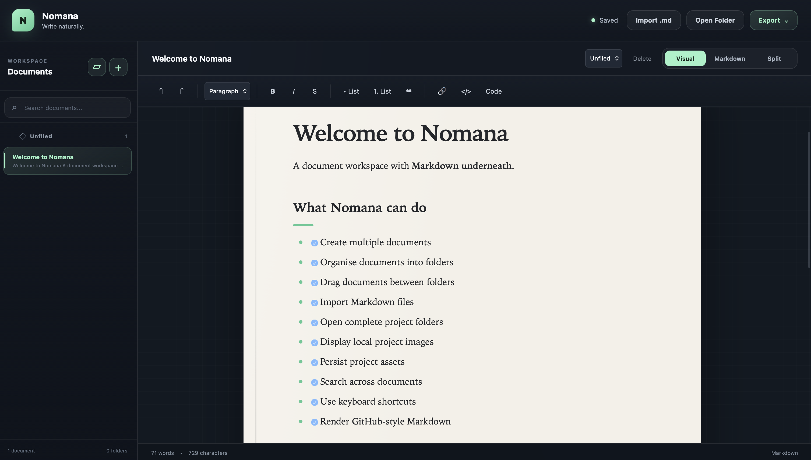
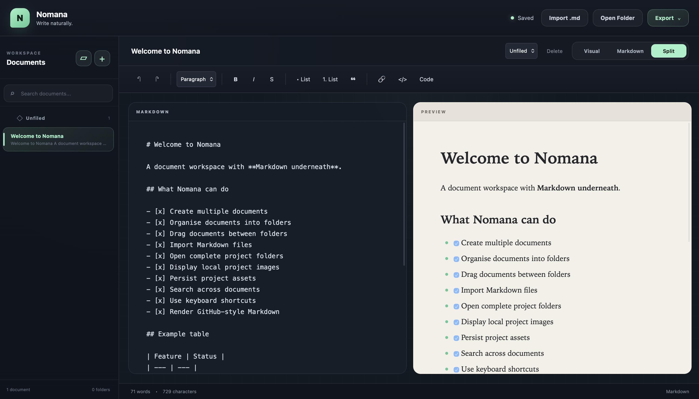

# Nomana

A browser-based Markdown document workspace combining visual editing with direct Markdown control.

Nomana is designed to make Markdown feel more like a complete writing environment while retaining the simplicity and portability of plain-text `.md` documents.

## Screenshots

### Nomana Editor



### Markdown Split View



## Features

- Visual, Markdown and Split editing modes
- Multi-document workspace
- Folder organisation
- Drag-and-drop document management
- Full-text document search
- Autosave and browser persistence
- Project-folder importing
- Local image support
- GitHub-flavoured Markdown
- Tables and task lists
- Fenced code blocks
- Blockquotes and nested lists
- Keyboard shortcuts
- Markdown export
- Standalone HTML export
- PDF export

## Technologies

- HTML
- CSS
- JavaScript
- IndexedDB
- localStorage
- Marked

## Running Nomana

Nomana requires no installation or build process.

Clone the repository:

```bash
git clone https://github.com/joakim-silva/nomana.git
cd nomana
```

Then open `index.html` in your browser.

## Keyboard Shortcuts

| Shortcut | Action |
| --- | --- |
| Cmd/Ctrl + B | Bold |
| Cmd/Ctrl + I | Italic |
| Cmd/Ctrl + K | Insert link |
| Cmd/Ctrl + N | New document |
| Cmd/Ctrl + F | Search |
| Cmd/Ctrl + S | Save |
| Cmd/Ctrl + 1 | Visual mode |
| Cmd/Ctrl + 2 | Markdown mode |
| Cmd/Ctrl + 3 | Split mode |

## Export

Nomana can export documents as:

- Markdown (`.md`)
- Standalone HTML (`.html`)
- PDF

## Status

**Nomana v1.0**

## Author

Joakim Silva